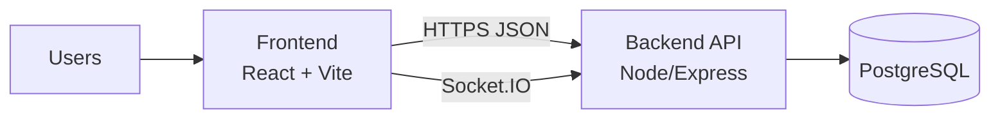
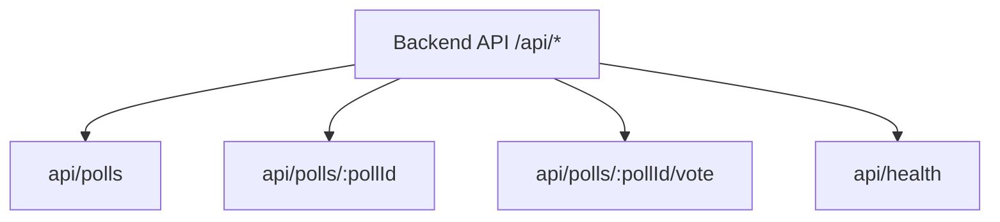
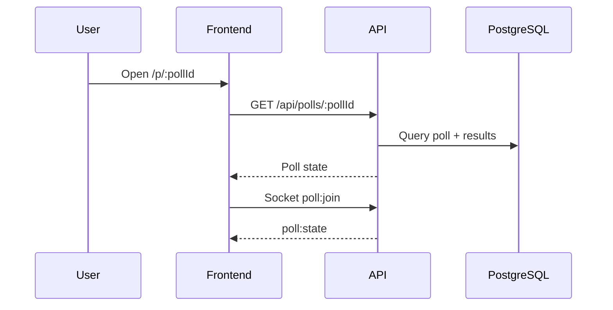
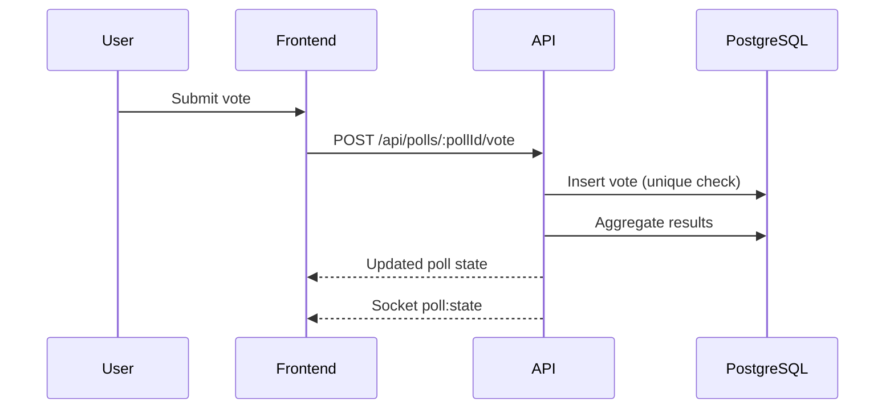

# PollRoom

Real-time poll rooms with shareable links, single-choice voting, and live Socket.IO updates.


Built by Shashank Preetham Pendyala

---

## Overview

PollRoom is a production-grade real-time poll platform that supports fast poll creation, shareable room links, and live results across all connected viewers. It combines REST for reliable state hydration with Socket.IO for real-time updates and PostgreSQL for persistence and correctness.

Success is measured by:
- Time from poll creation to first vote
- Live results latency across connected viewers
- Vote integrity under retries and refreshes
- Reconnect reliability and REST fallback success rate

---

## Table of Contents

- [Demo](#demo)
- [Features](#features)
- [Architecture](#architecture)
- [Layered Architecture](#layered-architecture)
- [Module Inventory](#module-inventory)
- [Tech Stack](#tech-stack)
- [Project Structure](#project-structure)
- [Backend API Map](#backend-api-map)
- [Workflow](#workflow)
- [Workflow Diagrams](#workflow-diagrams)
- [Data Model Summary](#data-model-summary)
- [Environment Variables](#environment-variables)
- [Setup and Run](#setup-and-run)
- [Run, Build, Test](#run-build-test)
- [Configuration](#configuration)
- [Deployment](#deployment)
- [Monitoring and Logging](#monitoring-and-logging)
- [Security Notes](#security-notes)
- [Troubleshooting](#troubleshooting)
- [Roadmap](#roadmap)
- [License](#license)

---

## Demo


---

## Features

### Core
- Create polls with 2-6 options
- Join by link or Poll ID
- Single-choice voting (server-enforced)
- Live results for all viewers
- Shared links open a focused poll view without sidebar to reduce distraction
- Refresh fallback + reconnect banner

### Reliability
- Persistent storage with PostgreSQL
- REST + WebSocket hybrid sync
- Clean error and retry states

### Anti-abuse
- One vote per poll per clientId
- IP + poll rate limiting

---

## Architecture

### System Overview


### Backend Modules View


---

## Layered Architecture

### Frontend Layer
- React + Vite SPA
- Poll creation, join, and live results UI
- React Query for REST, Socket.IO for realtime

### Backend Layer
- Express API with Zod validation
- Prisma ORM for persistence
- Socket.IO for live updates
- Rate limiting and clientId enforcement

### Database Layer
- PostgreSQL schema for Polls, Options, Votes
- Unique vote constraint and indexes for fast aggregation

---

## Module Inventory

### Frontend
- `client/src/pages/Home.tsx` Dashboard
- `client/src/pages/Create.tsx` Poll creation
- `client/src/pages/Join.tsx` Join by ID / link
- `client/src/pages/PollRoom.tsx` Live results and voting
- `client/src/pages/Notes.tsx` Assessment notes

### Backend
- `server/routes.ts` REST + Socket.IO handlers
- `server/index.ts` Server bootstrap + middleware

### Database
- `prisma/schema.prisma` Models + constraints
- `prisma/migrations/*` SQL migrations

---

## Tech Stack

- Frontend: React, Vite, TypeScript, Tailwind CSS
- Backend: Node.js, Express, Socket.IO
- Database: PostgreSQL + Prisma
- Validation: Zod

---

## Project Structure

- `client/` UI and pages
- `server/` Express + Socket.IO
- `prisma/` Schema + migrations
- `script/` Dev helpers
- `docker-compose.yml` Postgres for local dev

---

## Backend API Map

| Endpoint | Role | Purpose |
| --- | --- | --- |
| `POST /api/polls` | All | Create a poll |
| `GET /api/polls/:pollId` | All | Fetch poll state |
| `POST /api/polls/:pollId/vote` | All | Submit vote |
| `GET /api/health` | All | Health check |

---

## Workflow

### System Flow
1. User creates or joins a poll
2. Client fetches initial state via REST
3. Client subscribes to `poll:state` via Socket.IO
4. Votes are persisted, then broadcast to all viewers

### Event Pipeline
1. Vote received
2. DB write with unique constraint
3. Aggregation query
4. Broadcast `poll:state`

---

## Workflow Diagrams

### Poll Join + Live Updates


### Vote Flow


---

## Data Model Summary

Canonical schema in `prisma/schema.prisma` and includes:
- Poll
- PollOption
- Vote

Indexes:
- `UNIQUE (poll_id, client_id)`
- `INDEX (poll_id)`
- `INDEX (option_id)`

---

## Environment Variables

Configured in `.env` at repo root:
- `DATABASE_URL`
- `PUBLIC_BASE_URL`
- `CORS_ORIGIN`
- `IP_HASH_SALT`

---

## Setup and Run

### Prerequisites
- Node.js 20.19+ (or 22.12+)
- PostgreSQL 16+ or Docker

### Quick Start
1. Start Postgres (Docker)
2. Apply migrations
3. Start backend
4. Start frontend

---

## Run, Build, Test

```bash
# Start Postgres
docker compose up -d

# Install deps
npm install

# Migrate DB
npx prisma migrate dev

# Start full stack (dev)
npm run dev

# Build frontend only (Cloudflare Pages)
npm run build

# Build backend only (Railway)
npm run build:api
```

---

## Configuration

- REST endpoints in `server/routes.ts`
- Socket events: `poll:join`, `poll:state`, `poll:error`
- Sidebar hidden on shared poll links for focus

---

## Deployment

- Set all environment variables in your host
- Run database migrations once per environment
- Frontend (Cloudflare Pages): use `npm run build` and output `dist/public`
- Backend (Railway): use `npm run build:api` and `npm run start`
- CI/CD: both Railway and Cloudflare Pages redeploy automatically on every push to the connected `main` branch.

---

## Monitoring and Logging

- API request logging built into Express
- Monitor vote rates to validate anti-abuse behavior
- Track Socket.IO disconnect/reconnect frequency

---

## Security Notes

- Do not commit `.env`
- Rotate `IP_HASH_SALT` if leaked
- Keep DB credentials private

---

## Troubleshooting

- If sockets fail: ensure API is running on port 5001
- If votes fail: check DB and migrations
- If share links are wrong: set `PUBLIC_BASE_URL`

---

## Roadmap

- Poll closing / freeze votes
- Auth + poll ownership
- Analytics dashboard

---

## License

MIT License.
See [LICENSE](LICENSE).
